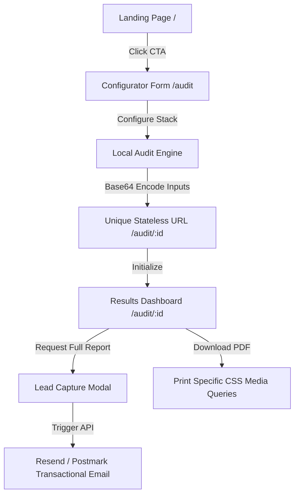

# BurnCheck AI Spend Audit — Software Architecture

This document describes the software architecture, design patterns, and engineering implementations of **BurnCheck**.

---

## 1. System Topology & Data Flow
BurnCheck is a 100% client-side, zero-database Single Page Application (SPA) designed to deliver high-performance dynamic auditing metrics without server latency or personal data leaks.



---

## 2. Stateless URL Design
To allow frictionless sharing without a relational database, BurnCheck implements a custom URL-safe Base64 state serialization mechanism.

### Serialization Logic
The configuration inputs from [AuditForm.jsx](file:///Users/brak/Desktop/BurnCheck/src/components/AuditForm.jsx) are structured as follows:
```json
{
  "teamSize": 5,
  "useCase": "Coding",
  "tools": [
    { "toolName": "Cursor", "plan": "Business", "spend": 80, "seats": 4 }
  ]
}
```

This object is compacted and encoded into a URL-safe Base64 string in [App.jsx](file:///Users/brak/Desktop/BurnCheck/src/App.jsx):
*   `encodeAuditId`: Maps tool properties to short arrays and serializes the state to a compressed string.
*   `decodeAuditId`: Reconstitutes the state, restoring trailing base64 padding characters (`=`) and mapping elements back to standardized form fields.
*   **Fallback Resolution**: If a user opens a link (such as `/audit/eyJ0Ijo1LCJ1IjoiQ29kaW5n...`) that is not present in their local browser storage, the `ResultsPage` dynamically parses the path parameters, computes the benchmarks in-memory on the fly, and loads the dashboard statelessly.

---

## 3. Kinetic Visual Engines
### 3D Spotlight Tilt Card
Integrated into [StepsRow.jsx](file:///Users/brak/Desktop/BurnCheck/src/components/StepsRow.jsx), [ToolsGrid.jsx](file:///Users/brak/Desktop/BurnCheck/src/components/ToolsGrid.jsx), and [AuditResults.jsx](file:///Users/brak/Desktop/BurnCheck/src/components/AuditResults.jsx).
*   Tracks cursor coordinates bounding-rect metrics.
*   Maps mouse offset to transform 3D perspective rotation values (`rotateX` / `rotateY`).
*   Binds CSS mouse coordinates (`--mouse-x` and `--mouse-y`) to trigger radial background cursor gradient highlights.

### Inferno Flame Cursor Trail
Implemented in [CustomCursor.jsx](file:///Users/brak/Desktop/BurnCheck/src/components/CustomCursor.jsx).
*   Constructs a Canvas-driven mouse-trail rendering loop.
*   Fires trail particles (`$`, `🔥`, `💸`) at mouse coords.
*   Applies individual physics: velocity vectors ($V_x$, $V_y$), upward friction drift, decay, and angular spin metrics.

---

## 4. Transactional Mail Integrations
Located in [AuditResults.jsx](file:///Users/brak/Desktop/BurnCheck/src/components/AuditResults.jsx)'s `submitLeadCapture`:
*   Reads `VITE_RESEND_API_KEY` or `VITE_POSTMARK_SERVER_TOKEN` from the client environment.
*   Constructs structured, styled HTML mail templates detailing the exact audit results, savings totals, and per-tool downgrade recommendations.
*   Executes fetch operations to Resend (`https://api.resend.com/emails`) or Postmark (`https://api.postmarkapp.com/email`) with safe header setups.

---

## 5. Print Media Layout Overrides
CSS rules in [index.css](file:///Users/brak/Desktop/BurnCheck/src/index.css) handle clean layout page print-outs:
*   Hides interactive headers, footers, share buttons, cursors, and modal interfaces using `display: none !important`.
*   Unfolds full table views, aligns cards inline, and adjusts text color metrics to produce standard black-and-white PDFs without color inversion errors.
